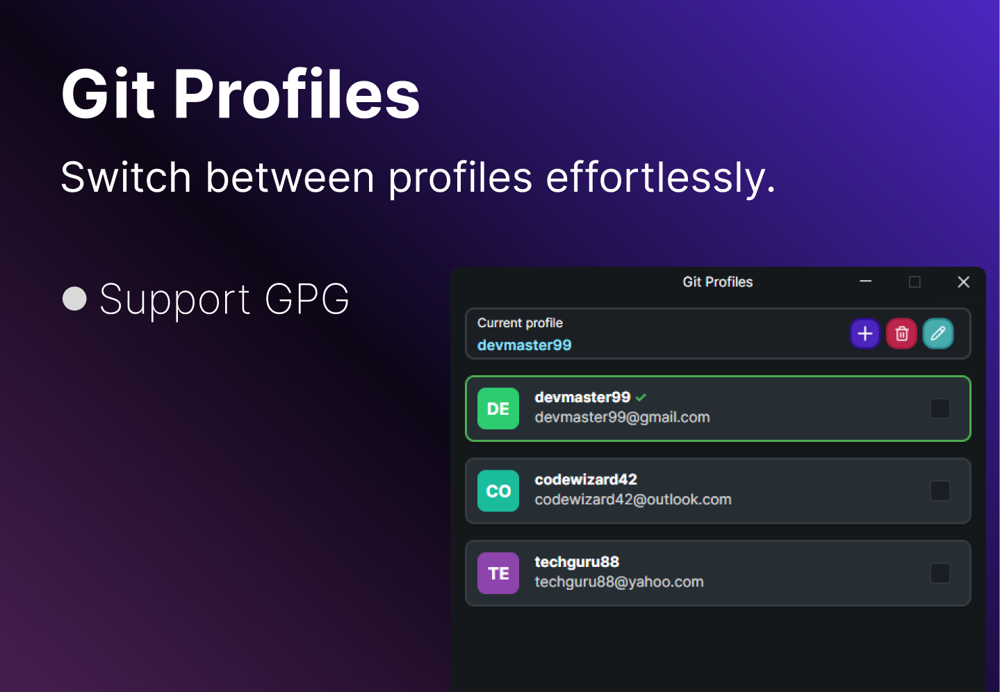

# Git Profiles Avalonia

A modern application to manage Git profiles, built with Avalonia UI.

## 🚀 Features

- Multiple Git profiles management
- Modern and intuitive user interface
- Quick switching between Git configurations
- Customization of name, email and additional settings

## ⚙️ Prerequisites

- Git installed on your system
- GPG installed (optional, for signing commits)

## 🛠️ Installation

1. Download the latest version from releases section
2. Ready to use!

## 💻 How to Use

1. Open the application
2. Add a new profile using the "+" button
3. Configure your Git name and email
4. Save and activate the profile when needed

## 🔧 Technologies

- Avalonia UI (.NET Framework)
- .NET 9

## 📝 License

This project is under the MIT License.
